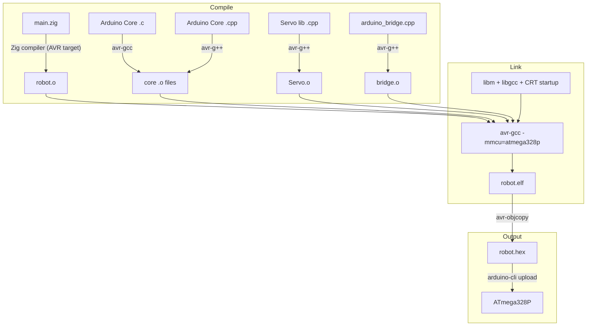
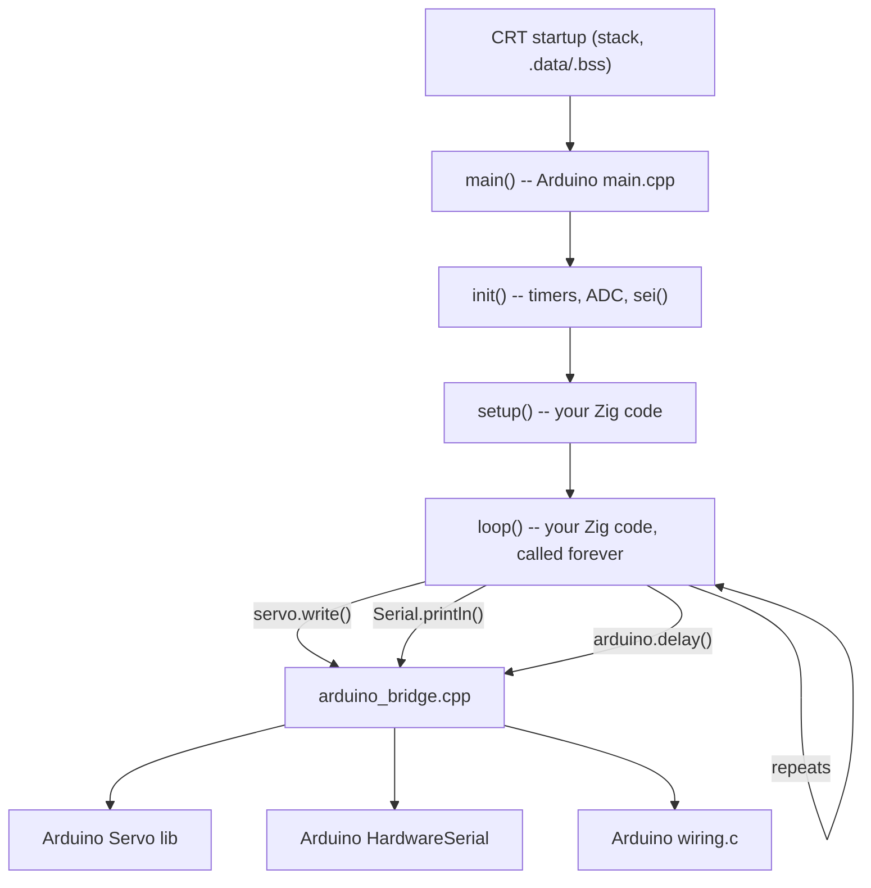

# Robot Arm Firmware (Zig + Arduino)

Firmware for an Arduino Uno (ATmega328P) robot arm, written in Zig with
Arduino core libraries handling hardware peripherals.

## Architecture

Application logic lives in Zig. Arduino's C++ core handles hardware
initialization, interrupts, and peripheral drivers. A thin C++ bridge
(`arduino_bridge.cpp`) exposes Arduino APIs to Zig via `extern "C"` functions.



## Call Flow at Runtime

Arduino's `main.cpp` (from ArduinoCore-avr) is the real entry point:



## Project Structure

```
zig/
  build.zig           -- build pipeline: Zig compiler + avr-gcc + avr-objcopy
  build.zig.zon       -- dependencies (ArduinoCore-avr, Servo library)
  src/
    main.zig           -- application: setup() and loop() entry points
    lib/
      arduino.zig      -- Zig bindings for Arduino core (Serial, GPIO, delay)
      servo.zig        -- Zig Servo struct wrapping the Arduino Servo library
      arduino_bridge.cpp  -- C++ bridge: exposes Arduino APIs as extern "C"
```

## Dependencies

| Dependency | Version | Purpose |
|---|---|---|
| [ArduinoCore-avr](https://github.com/arduino/ArduinoCore-avr) | 1.8.7 | Arduino core (wiring, serial, timers, main.cpp) |
| [Servo](https://github.com/arduino-libraries/Servo) | 1.2.2 | Servo motor control via Timer1 |

Managed via `build.zig.zon` -- Zig fetches them automatically.

## Toolchain Requirements

- **Zig** >= 0.15.2
- **avr-gcc** 9.x (`brew install avr-gcc@9`)
- **avr-binutils** (`brew install avr-binutils`)
- **arduino-cli** (for uploading and serial monitoring)

## Build and Flash

```sh
# Build only (produces zig-out/firmware/robot.hex)
cd zig && zig build

# Or from the repo root using make:
make deploy_zig     # build + upload
make monit          # open serial monitor (9600 baud)
```

## Adding a New Arduino Library

1. Add the dependency to `build.zig.zon` (use `zig fetch --save <url>`)
2. In `build.zig`: add `b.dependency(...)`, append its include path to
   `include_paths`, compile its `.cpp` source with `compileWithAvrGpp`
3. In `arduino_bridge.cpp`: add `extern "C"` wrapper functions
4. In `src/lib/`: create a `.zig` module with `@extern` bindings
